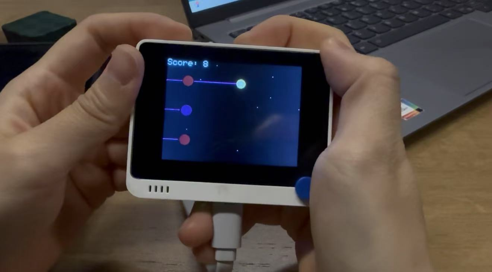
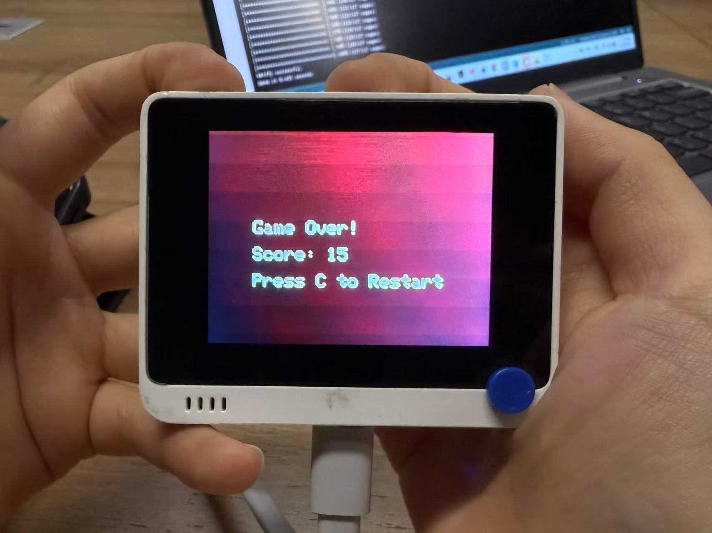

# 光点接力（Glow Relay）小游戏（基于 Seeed Studio Wio Terminal）

## 项目概述和目标

“光点接力”是一个基于 Seeed Studio Wio Terminal 设计的交互式迷你游戏，利用设备的 2.4 寸 TFT 彩屏和内置蜂鸣器，带来视觉与听觉的双重体验。玩家通过 Wio Terminal 的三个顶部按键操控一个闪烁的彩色光点，在三条淡紫色跑道间跳跃，目标是精准接住从屏幕右侧飞来的五角星火炬。游戏以简洁的操作和流畅的动画为核心，营造出紧张刺激又轻松有趣的体验。无论是独自挑战反应极限，还是与朋友展开分数争夺，光点接力都能在小巧的 Wio Terminal 上点燃乐趣。

**目标**：

- **打造趣味体验**：创造一个简单易上手的反应类游戏，适合各年龄段玩家，通过快速按键挑战手眼协调，带来成就感和欢乐。
- **充分应该硬件条件**：充分利用 Wio Terminal 的TFT 屏幕（320x240）和蜂鸣器功能，呈现星空背景、渐变光点和动态火炬，展示其作为开发平台的潜力。
- **新手友好：**作为入门项目，激发 Arduino 开发兴趣，支持扩展创意。适合初学者、DIY 爱好者，5 分钟上手。

## 材料清单与环境设置

### 材料清单

- **Wio Terminal**：主设备，包含 2.4 寸 TFT 屏幕、蜂鸣器等其他配置。
- **USB-C 数据线**：连接电脑，用于供电+烧录代码。
- **电脑**：Windows（推荐）、Mac 或 Linux。

### 环境设置

1. 安装 Arduino IDE：
   - 下载：https://www.arduino.cc/en/software （2.3.x 推荐）
   - 安装并打开
2. 配置开发板卡包：
   - 工具 > 开发板 > 板卡管理器，选择 Seeed SAMD -> Seeeduino Wio terminal
   - 安装最新版本
3. 安装库：
   - 从 Seeed wiki的教程指引中在GitHub中下载.zip安装包
   - 安装 2.5.x 版本
4. 验证硬件连接：
   - 用 USB-C 数据线连接 Wio Terminal 和电脑
   - 确认设备识别：
     - 工具 > 端口，选择 Wio Terminal 的 COM 端口（若无，检查驱动或线）
5. 准备项目文件夹：
   - 在 C:\Users\seeed\Documents\Arduino 创建文件夹 Glow_Relay
   - 后续代码（Glow_Relay.ino）将保存于此

## 详细步骤说明

以下是使用“光点接力”项目的指南，涵盖从准备代码到运行游戏的每一个步骤。这个项目在 Seeed Studio Wio Terminal 上运行，利用三个右侧按键控制光点跳跃，接住火炬得分。

### 步骤 1：准备项目文件夹

1. **创建文件夹**：

   - 在电脑上，打开文件资源管理器（Windows：`C:\Users\seeed\Documents\Arduino`）
   - 新建文件夹，命名为 `Glow_Relay`（路径如 `C:\Users\seeed\Documents\Arduino\Glow_Relay`）
   - 这将存储游戏代码和文档

2. **获取代码**：

   - 打开 Arduino IDE（确保已安装）
   - 文件 > 新建，保存为 `Glow_Relay.ino`（在 `Glow_Relay` 文件夹）
   - 打开游戏代码（见项目仓库或后续步骤）

   **提示**：若从 GitHub 下载代码，解压到 `Glow_Relay` 文件夹，确保包含 `Glow_Relay.ino`

### 步骤 2：确认硬件连接

1. **连接 Wio Terminal**：

   - 用 USB-C 数据线（支持数据传输，非仅充电）连接 Wio Terminal 到电脑 USB 端口

2. **检查端口**：

   - 在 Arduino IDE，点击 **工具 > 端口**
   - 选择 Wio Terminal 的 COM 端口（如 `COM7`）

3. **测试硬件**：

   - 确认屏幕功能：

     - 新建草稿，粘贴以下代码：

       ```cpp
       #include <TFT_eSPI.h>
       TFT_eSPI tft = TFT_eSPI();
       void setup() {
         tft.begin();
         tft.setRotation(3);
         tft.fillScreen(TFT_BLUE);
       }
       void loop() {}
       ```

     - 工具 > 开发板 > Seeeduino Wio Terminal，选正确端口，上传

     - Wio Terminal 屏幕应显示纯蓝，表示屏幕正常

     - 若黑屏，检查 `TFT_eSPI` 库和 `User_Setup.h`（见环境设置）

   - 确认蜂鸣器：

     - 上传：

       ```cpp
       void setup() {
         pinMode(WIO_BUZZER, OUTPUT);
       }
       void loop() {
         tone(WIO_BUZZER, 1000, 50);
         delay(1000);
       }
       ```

     - 每秒应听到“叮”音。

### 步骤 3：上传游戏代码

1. **打开代码**：

   - 在 Arduino IDE，打开 `Glow_Relay.ino`

   **注意**：代码使用官方宏（`WIO_KEY_A/B/C`, `WIO_BUZZER`），确保环境设置正确（Seeed SAMD 1.8.x+, `TFT_eSPI` 2.5.x）

2. **验证代码**：

   - 检查包含库：`#include <TFT_eSPI.h>`, `#include <Arduino.h>`
   - 确认按键：`pinMode(WIO_KEY_A, INPUT_PULLUP)` 等
   - 确认蜂鸣器：`pinMode(WIO_BUZZER, OUTPUT)`

3. **上传**：

   - 工具 > 板卡：选“Seeeduino Wio Terminal”
   - 工具 > 端口：选 COM 端口
   - 点击上传
   - 成功后，Wio Terminal 显示星空背景、淡紫跑道（Y=50、120、190）、光点（X=50，Y=120）和火炬（X=320）

### 步骤 4：玩光点接力

1. **启动游戏**：
   - 上传后，屏幕显示：
     - **背景**：深蓝渐变+8个星星碎片
     - **跑道**：3条淡紫单线（Y=50、120、190）
     - **光点**：渐变星光（12像素，初始红，X=50，Y=120）
     - **火炬**：五角星+光晕（8像素，X=320，Y随机）
     - **分数**：左上角 - Score: 0
2. **操作**：
   - 按键（顶部三个按键）：
     - 右按键：光点跳上跑道（Y=50）
     - 中按键：中跑道（Y=120）
     - 左按键：下跑道（Y=190）
   - 目标：
     - 火炬从右向左滑（初始3像素/帧）
     - 调整光点到同跑道（Y对齐），在火炬到达X=50时接住
   - 接住：
     - 分数+1（Score: X）
     - 光点换色（红→橙→黄→绿→青→蓝→紫）
     - 每2次火炬加速0.5像素/帧（上限8）
     - 蜂鸣器“叮”（1000Hz，50ms）
   - 错过：
     - 火炬滑过X<40，游戏结束
     - 渐变红屏，“Game Over! Score: X”和“Press C to Restart”
     - 蜂鸣器“嗡”（500Hz，200ms）
   - 重启：
     - 按下左按键，重置分数、光点、星星
3. **玩法建议**：
   - **单人**：挑战高分，设定目标分数
   - **多人**：轮流玩，看谁接最多星星

### 步骤 5：调试与优化

1. **按键无反应**：

   - 打开串口监视器（工具 > 串口监视器，115200）

   - 运行游戏，观察“Key A/B/C pressed”

   - 若无：

     - 上传测试代码：

       ```cpp
       #include <Arduino.h>
       void setup() {
         Serial.begin(115200);
         pinMode(WIO_KEY_A, INPUT_PULLUP);
         pinMode(WIO_KEY_B, INPUT_PULLUP);
         pinMode(WIO_KEY_C, INPUT_PULLUP);
       }
       void loop() {
         Serial.print("A: "); Serial.println(digitalRead(WIO_KEY_A));
         Serial.print("B: "); Serial.println(digitalRead(WIO_KEY_B));
         Serial.print("C: "); Serial.println(digitalRead(WIO_KEY_C));
         delay(100);
       }
       ```

     - 按键，预期未按1，按下0

     - 无0，检查：

       - 硬件：按键是否“咔嗒”，清洁按键区域
       - 固件：更新（https://wiki.seeedstudio.com/Wio-Terminal-Firmware/）

2. **优化体验**：

   - **难度**：编辑代码，改`if (torchCount % 2 == 0)`为`% 3`（可调整星星加速频率）
   - **光点**：调`LIGHT_SIZE=14`（更大）
   - **火炬**：调`TORCH_SIZE=10`（更显眼）
   - 保存，重新上传。

## 代码解析

- - ### 代码逻辑概述

    游戏逻辑围绕玩家按键操作和屏幕动态更新展开：

    1. **启动**：初始化屏幕、按键、蜂鸣器，绘制星空和跑道。
    2. **游戏中**：读取按键切换光点跑道，移动火炬，检测是否接住，更新分数和速度。
    3. **结束**：显示红屏和分数，按键重启。

    核心流程：初始化 → 按键控制 → 火炬移动 → 绘制画面 → 判断结果，循环运行，约 33 帧/秒。

    ### 主要环节解析

    #### 1. 初始化

    **代码片段**:

    ```cpp
    void setup() {
      Serial.begin(115200);
      tft.begin();
      tft.setRotation(3);
      // 星空背景
      for (int y = 0; y < SCREEN_H / 2; y++) {
        tft.drawFastHLine(0, y, SCREEN_W, tft.color565(0, 0, 16 * y / SCREEN_H));
      }
      for (int y = SCREEN_H / 2; y < SCREEN_H; y++) {
        tft.drawFastHLine(0, y, SCREEN_W, TFT_BLACK);
      }
      for (int i = 0; i < 8; i++) {
        tft.drawPixel(random(SCREEN_W), random(SCREEN_H), TFT_WHITE);
      }
      tft.setTextColor(TFT_WHITE, TFT_BLACK);
      tft.setTextSize(2);
      pinMode(WIO_KEY_A, INPUT_PULLUP);
      pinMode(WIO_KEY_B, INPUT_PULLUP);
      pinMode(WIO_KEY_C, INPUT_PULLUP);
      pinMode(WIO_BUZZER, OUTPUT);
      digitalWrite(WIO_BUZZER, LOW);
      // 跑道
      for (int i = 0; i < 3; i++) {
        tft.drawFastHLine(0, TRACK_Y[i], SCREEN_W, 0xC81F);
      }
    }
    ```

    **解析**:

    - **作用**：启动时配置硬件，绘制初始画面
    - **逻辑**：
      - **屏幕**：启动 TFT（tft.begin()），设横屏（setRotation(3)，320x240）
      - **背景**：上半屏深蓝渐变（0,0,0→0,0,16），下半屏黑，画8个随机白点（星星）
      - **文字**：设置白字黑底（分数、结束提示），字体大小2
      - **按键**：WIO_KEY_A/B/C设为输入上拉（按下0）
      - **蜂鸣器**：WIO_BUZZER设输出，初始关闭
      - **跑道**：3条淡紫线（0xC81F，Y=50、120、190）
    - **目的**：准备游戏环境，光点（中跑道，Y=120）和火炬（X=320）就位

    #### 2. 按键处理

    **代码片段**:

    ```cpp
    bool keyPressed = false;
    if (digitalRead(WIO_KEY_A) == LOW && lightTrack != 0) {
      lightTrack = 0;
      keyPressed = true;
      Serial.println("Key A pressed");
    } else if (digitalRead(WIO_KEY_B) == LOW && lightTrack != 1) {
      lightTrack = 1;
      keyPressed = true;
      Serial.println("Key B pressed");
    } else if (digitalRead(WIO_KEY_C) == LOW && lightTrack != 2) {
      lightTrack = 2;
      keyPressed = true;
      Serial.println("Key C pressed");
    }
    if (keyPressed) {
      delay(100);
    }
    ```

    **解析**:

    - **作用**：读取玩家按键，切换光点跑道
    - **逻辑**：
      - **检测**：
        - WIO_KEY_A：若按下（低电平）且不在上跑道（lightTrack != 0），设lightTrack=0（Y=50）
        - WIO_KEY_B：中跑道（lightTrack=1, Y=120）
        - WIO_KEY_C：下跑道（lightTrack=2, Y=190）
      - **调试**：Serial.println输出按键状态
      - **消抖**：delay(100)，防止快速误触
    - **目的**：响应玩家输入，控制光点位置

    #### 3. 火炬移动与碰撞

    **代码片段**:

    ```cpp
    tft.fillCircle(torchX, TRACK_Y[torchTrack], TORCH_SIZE + 2, TFT_BLACK);
    torchX -= (int)torchSpeed;
    if (torchX < 50 - TORCH_SIZE) {
      if (lightTrack == torchTrack) {
        score++;
        torchCount++;
        colorIndex = (colorIndex + 1) % 7;
        if (torchCount % 2 == 0) {
          torchSpeed += 0.5;
          if (torchSpeed > 8.0) torchSpeed = 8.0;
        }
        tone(WIO_BUZZER, 1000, 50);
        torchX = 320;
        torchTrack = random(3);
      } else {
        gameOver = true;
        tone(WIO_BUZZER, 500, 200);
      }
    }
    ```

    **解析**:

    - **作用**：移动火炬，判断是否接住
    - **逻辑**：
      - **擦旧**：用黑圆覆盖旧火炬（TORCH_SIZE + 2，防残影）
      - **移动**：torchX -= torchSpeed，左移（初始3像素/帧）
      - **碰撞**：
        - if (torchX < 50 - TORCH_SIZE)：火炬到光点（X<42）
          - **接住**（lightTrack == torchTrack）：
            - score++：分数加1
            - torchCount++：计数
            - colorIndex++ % 7：光点换色（7色循环）
            - if (torchCount % 2 == 0)：每2次加速0.5（上限8）
            - tone(WIO_BUZZER, 1000, 50)：“叮”
            - torchX=320, torchTrack=random(3)：新火炬
          - **错过**：
            - gameOver=true
            - tone(WIO_BUZZER, 500, 200)：“嗡”
    - **目的**：动态更新火炬，处理游戏结果

    #### 4. 画面绘制

    **代码片段**:

    ```cpp
    tft.fillCircle(50, TRACK_Y[lightTrack], LIGHT_SIZE + 2, TFT_BLACK);
    tft.fillCircle(50, TRACK_Y[lightTrack], 8, colors[colorIndex]);
    tft.fillCircle(50, TRACK_Y[lightTrack], LIGHT_SIZE, darkColors[colorIndex]);
    
    if (frameCount % 5 < 3) {
      tft.fillCircle(torchX, TRACK_Y[torchTrack], TORCH_SIZE + 2, tft.color565(255, 255, 128));
      drawStar(torchX, TRACK_Y[torchTrack], TORCH_SIZE, TFT_WHITE);
    } else {
      tft.fillCircle(torchX, TRACK_Y[torchTrack], TORCH_SIZE + 2, tft.color565(200, 200, 100));
      drawStar(torchX, TRACK_Y[torchTrack], TORCH_SIZE, 0xC618);
    }
    
    tft.fillRect(0, 0, 100, 20, TFT_BLACK);
    tft.setCursor(0, 0);
    tft.print("Score: ");
    tft.print(score);
    
    delay(30);
    ```

    **解析**:

    - **作用**：绘制光点、火炬、分数
    - **逻辑**：
      - **光点**：
        - 擦旧（黑圆，14像素）
        - 内圆（8像素，亮色）
        - 外圆（12像素，暗色），营造星光渐变
      - **火炬**：
        - 擦旧（黑圆，10像素）
        - 光晕（10像素，亮黄/暗黄，5帧切换）
        - 五角星（8像素，白/银灰）
      - **分数**：
        - 擦旧（黑矩形）
        - 画“Score: X”
      - **帧率**：delay(30)，约33帧/秒
    - **目的**：实时更新画面，保持流畅美观

## 应用示例和扩展思路

### 应用示例

- **单人挑战**：设定目标分数、刷新个人记录




### 扩展思路

1. 视觉：
   - 光点加尾迹（画5个渐淡圆）
   - 火炬变心形（改`drawStar`）
   - 跑道动态闪（每5帧随机亮度）
2. 玩法：
   - 加道具（彩色火炬，双倍分）
   - 计时赛（60秒最多火炬）
   - 难度等级（初始`torchSpeed=2/4`）
3. 硬件：
   - 用加速度传感器（`LIS3DHTR`）控制光点（倾斜跳跑道）
   - 加LED灯（外接，同步光点颜色）

## 参考资源

- Wio Terminal文档：
  - https://wiki.seeedstudio.com/Wio-Terminal-Getting-Started/
  - https://wiki.seeedstudio.com/Wio-Terminal-Buttons/
  - https://wiki.seeedstudio.com/Wio-Terminal-Buzzer/
- TFT_eSPI库：
  - https://github.com/Seeed-Projects/SeeedStudio_TFT_eSPI
- 社区支持：
  - https://github.com/Seeed-Studio

## 作者

- 郭睿雪
- 关乃莹
